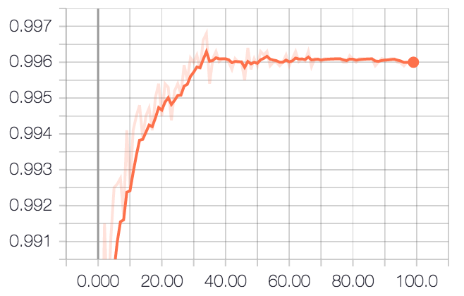

### More Experimental Results!

We also ran experiments varying batch sizes. In our previous experiments, we ran the Keras capsule network implementation using the CPU and GPU versions of Tensorflow and Horovod on with a default batch size of 100.
We ran tests with batch sizes of 50, 75, and 200, using 5 machines and running for 100 epochs. Halving the batch size meant the number of images our capsule network trained on was doubled. We did not see a significant improvement in accuracy running on a larger training set. Our network was able to achieve a validation accuracy of 99.6%. Running our capsule network with batch sizes of 50 and 200 also did not spark a significant improvement in accuracy.

Here's a simple graph of the validation accuracy of our capsule network running with a batch size of 50 over 100 epochs:

From these tests varying batch sizes, we did not see any sufficient improvement in validation accuracy regardless of batch size. Therefore, we conclude that the batch size does not have a considerable impact on accuracy.
