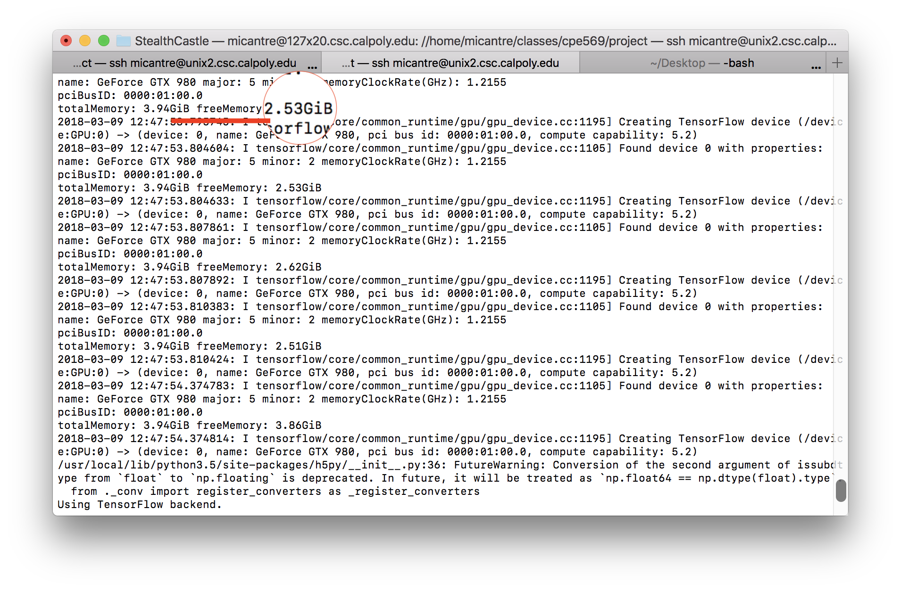
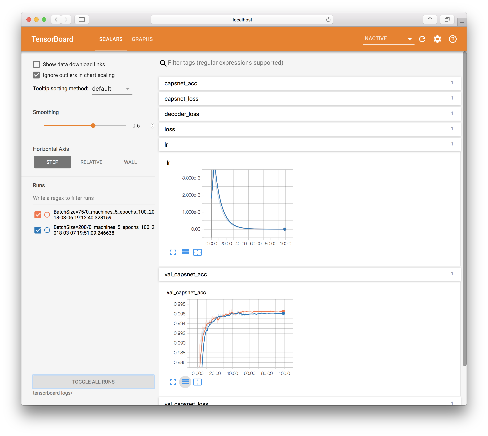

### Experiment Time!
I have always thought it was a bit silly that the field of computer science was called "computer science". As far as I had ever experienced, there was nothing really sciencey about it. You take technologies that have already been proven to be useful, and use them to make something. That was pretty much the extent of my experience. Recently, however, I finally got the opporunity to learn more about where the word "science" really comes from. This quarter I got the opportunity to play around with and run experiemnts on capsule networks.

#### Setting Up My Environment:
This part was a pain in the butt. I had to simultenously learn how to do several things in order to get started. First, there was relearning how python works. To be hoenst, I haven't used this language much since I first started learning how to program. Second, I had to learn how to interface with Tensorflow. Thankfully, Keras helped abstract a lot of the ugly math away from me, so this part wasn't as difficult. Next, I had to somehow figure out how to incorperate Horovod into all of this so that I could distribute my network. Again, thankfully this was surprisingly easy. I had to copy a few lines of code that they recommended here and there throughout my python script and then I was good to go on that end. Finally, after hours of playing around with different versions of libraries and setting different environment variabels, I was running experiments. I saw something similar to this in my console.

In this experiment I am running on five machines. This image details the specifications and resources available on the five machiens I was using. These machines are actually open to use by anyone at my school. The highest I have ever seen the number highlighted in the image is around 4GB. I needed several GB of free memory if I wanted to run my experiments at any reasonable speed. When I started trying to run experiments, I actaully kept getting a bunch of memory errors. I then checked the ammount of free memory and realized that on one of the machines it was only around 40MB. Somebody was running a program on one of the machines I was attempting to use that was eating up all of the memory, leaving me with basically nothing to work with. It was at this moment that I realized how much of a competition it would be to get access to several computers simultaneously, each with enough free memory to train my network.

Finally, I was able to get a few GB on 5 machines and successfully ran some experiments. In order to understand any of the data that was being recording, I used a tool called "TensorBoard" which took in some of the log files generated throughout the training and displayed it in nice graphs. Here is an example of what TensorBoard provided me with.

