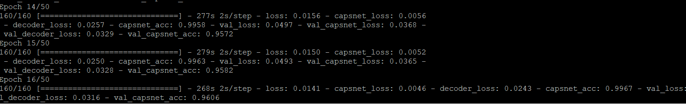

## Testing Capsule Network with different datasets : Rotated MNIST

### Overview of the robustness of Capsule Network
As we know, the convolutional neural network makes neural activity **invariant** to small changes in viewpoint. This is called translation invariance. This is good, but not the best because when we rotate or do some affine transform to the images, CNN cannot handle that issues efficiently. Capsule network solves this issue by introducing equivariance. It means the change in viewpoint leads to corresponding changes in neural activity, and the weight matrix of capsule network will encode the view-point invariant knowledge, not the neural activities as the CNN does.

Therefore, to test the robustness of capsule network, we will use rotated MNIST. We will have 2 models to compare the result: one is the baseline network, the other is our capsule network. The architecture of the baseline network is taken from the original paper [Dynamic Routing Between Capsules](https://arxiv.org/pdf/1710.09829.pdf). This is a standard CNN with three convolutional layers are followed by 2 fully connected layers of size 328, 192. The last fully connected layer is connected with dropout to a 10 class softmax layer with cross entropy loss. This baseline network is already implemented through this [link](https://github.com/shinseung428/CapsNet_Tensorflow/blob/master/models/baseline_network.py). 

### How to test the robustness of Capsule Network

First, we train both baseline network and capsule network on the normal 28x28 MNIST dataset. After that, we randomly rotated the test set to some degrees and run the experiment on this test set. For capsule network parameter, we use 7 machines with epochs = 25 and batch size = 64.

**Normal MNIST for training**

**Rotated MNIST for testing**

### Run experiment and results
Baseline Network - Randomly Rotated [-30, +30]

Capsule Network - Randomly Rotated [-30, +30]

Baseline Network - Randomly Rotated [-60, +60]

Capsule Network - Randomly Rotated [-60, +60]

| Randomly Rotate                    | Baseline Network  | Capsule Network   |
| :---:                              |:---:              | :---:             |
| [-30o, +30o] | 0.9525            | 0.9582            |
| [-60o, +60o] | **0.7424**        | **0.7635**        |

When we rotate the image in the range [-30o, +30o], the results of 2 networks are approximately identical. This makes sense because rotating a small angle is similar to applying data augmentation to the dataset. CNN will try to learn the translation invariance. However, when we rotate the image in the range [-60o, +60o], there is a difference between those networks. The capsule network gets a higher accuracy (0.7635) than that of baseline network (0.7424). It means that the capsule network will try to learn the equivariance, not the translation invariance.
