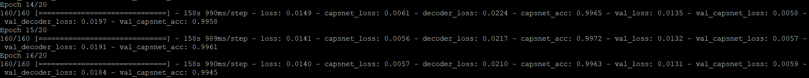
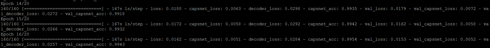
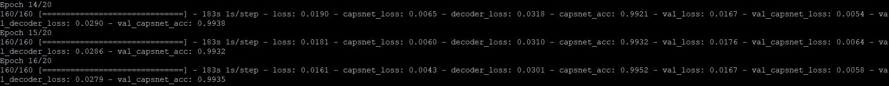

## Testing Capsule Network with different routing iterations

### Overview of routing iterations in dynamic routing of Capsule Network

Routing iterations is the number of times we need to repeat the dynamic routing algorithm to establish the agreement between low-level capsules with high-level capsules. 

#### Explain routing iterations using clustering [Link to the image](https://dasayan05.github.io/blog/jekyll/update/2017/11/20/an-intuitive-understanding-of-capsules.html)

In the left image, all the points represents all the connections from the all low-level capsules to one high-level capsule only. In the first iterations, all connections are established. Then, repeating dynamic routing multiple times will find out a group of low-level capsules that strongly agree to each other. It can be shown in the right image, which is the second iteration of dynamic routing. Some points (light color points) are pruned out, and dark points are stayed. The fact that those dark points stayed together and formed a cluster means they represents the strong agreement (strong connections) from those low-level capsules to this high-level capsule. The algorithm is similar to k-means clustering, where we have to group those points that are near together. The routing iterations in this case is how many times we have to calculate the weighted mean to figure out the center of the cluster.

#### Explain routing iterations using connected layers [Link to the image](https://www.slideshare.net/charlesmartin141/capsule-networks-84754653)

This image explains the above routing iterations in another way using neural network context. At first, we assume all the low-level capsules (PrimaryCap) will be fully connected with high-level capsules (DigitCaps). After doing dynamic routing a few times, the connections from the low-level capsules (PrimaryCaps) to high-level capsules (DigitCaps) will not be fully connected anymore; instead, some of the connections are pruned, leaving all the connections that best matches outputs from the lower level capsules (PrimaryCaps) with outputs of higher level capsules (DigitCaps). The black connections are the initial connections, and the blue connections are the ones after running for *r* routing iterations

Therefore, after *r* times, all outputs for higher level capsules were calculated and routing weights have been established. The forward pass can continue to the next level of network

### How many routing iterations are sufficient?
In the paper, Hinton et al claims that more iterations tends to overfit the data and it is recommended to use 3 routing iterations in practice. To test his idea, we will try to train the Capsule Network with 3, 5, 10, 15 iterations and check the accuracy of the network to see if it is increased or not. Here are some of the examples when training Capsule Network with different routing iterations:

....

Routing Iterations = 2

Routing Iterations = 5

Routing Iterations = 10

....

| Routing Iterations  | Accuracy   |
| :---:               | :---:      |
| 1                   | 0.9899     |
| **2**               | **0.9961** |
| **3**               | **0.9965** |
| **4**               | **0.9958** |
| 5                   | 0.9932     |
| 10                  | 0.9932     |

As we can see, we get the high accuracy when routings iterations are from 2 to 4. After that, when we increase the routing iterations more, the accuracy does not improve and even tends to decrease by around 0.003. Therefore, we can conclude that the capsule network works well when routing iterations are in range [2, 4] 
